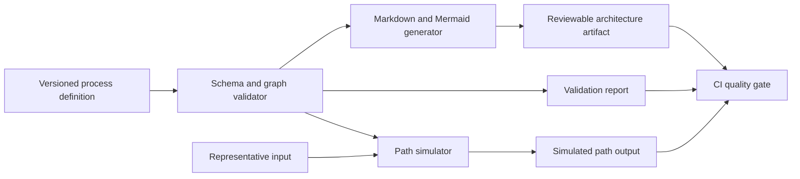

# Architecture

## Purpose
This toolkit acts as a CI/CD quality gate for low-code-style process definitions. It validates workflow structure, simulates routing paths, and generates reviewable documentation so process changes can be checked before deployment.

## Flow

1. Load a process definition from JSON.
2. Validate schema, transitions, ownership metadata, and reachability.
3. Simulate paths for representative business inputs.
4. Generate Markdown and Mermaid documentation.
5. Use the outputs in pull requests and CI to review process changes.

## Why it matters
Process automation platforms become hard to maintain when definitions are changed without structural checks or clear review artefacts. This repo focuses on that gap directly.
