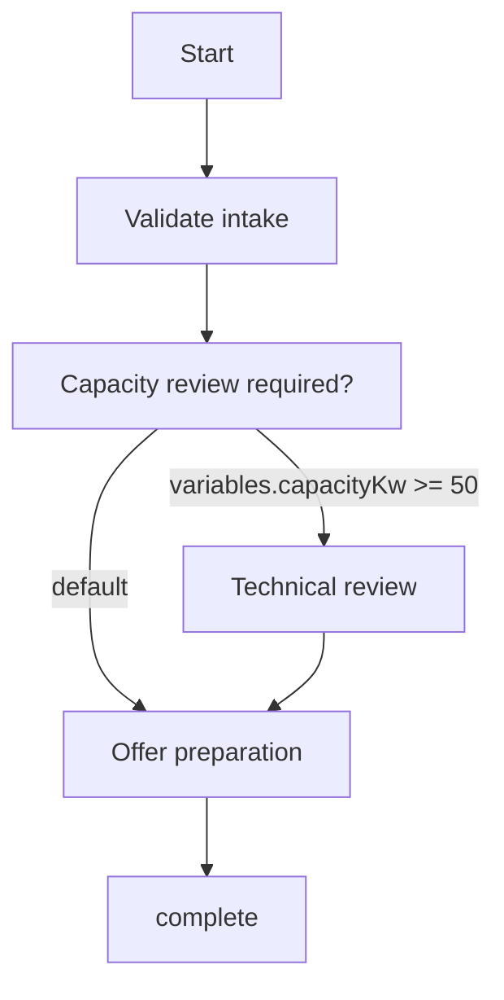

# Grid Connection Request

- Key: `grid-connection-request`
- Version: 1
- Start node: `start`

## Nodes

| Node ID | Type | Name | Owner | SLA (hours) |
|---|---|---|---|---|
| start | start | Start | - | - |
| validate-intake | serviceTask | Validate intake | - | - |
| capacity-review | decision | Capacity review required? | - | - |
| technical-review | userTask | Technical review | Grid Engineering | 24 |
| offer-preparation | userTask | Offer preparation | Customer Operations | 16 |
| complete | end | Complete | - | - |

## Mermaid Flow

## Validation Summary

- Errors: none
- Warnings: none
